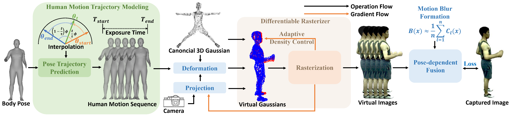

# Deblur-Avatar: Animatable Avatars from Motion-Blurred Monocular Videos
## [Paper](https://arxiv.org/abs/2501.13335) 
 

This repository contains the implementation of Deblur-Avatar: Animatable Avatars from Motion-Blurred Monocular Videos.


This repository is built upon the original [3DGS-Avatar](https://github.com/mikeqzy/3dgs-avatar-release) implementation. The experimental setup and dataset loading follow the same configuration as the original paper.

## Training

To train the model:

````bash
python train.py dataset=zjumocap_377_pose
````

## Evaluation

To evaluate the method for a specified subject, run:

````bash
python render.py mode=test dataset.test_mode=view dataset=zjumocap_377_pose
````


```bibtex
@article{luo2025deblur,
  title={Deblur-Avatar: Animatable Avatars from Motion-Blurred Monocular Videos},
  author={Luo, Xianrui and Peng, Juewen and Cai, Zhongang and Yang, Lei and Yang, Fan and Cao, Zhiguo and Lin, Guosheng},
  journal={arXiv preprint arXiv:2501.13335},
  year={2025}
}
```


